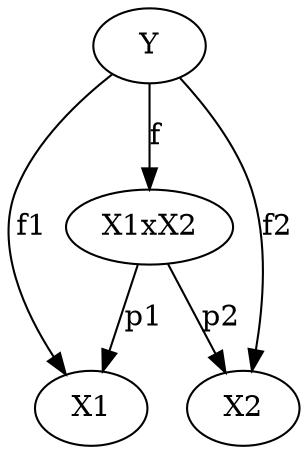
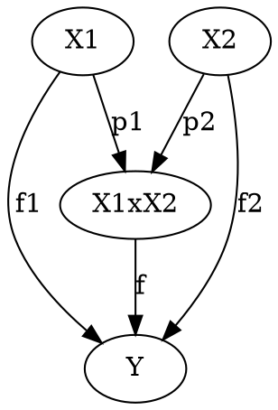

# 直積と直和（圏論）

## 直積

### 定義

圏Cの対象$X_1, X_2$に対して$(X_1\times X_2, \pi_1,\pi_2)$を直積という．ただし，$X_1\times X_2$はCの対象であり，$\pi_1 : X_1\times X_2\to X_1$$\pi_2 : X_1\times X_2\to X_2$は以下の普遍性を満たす射である．

普遍性：
対象$X_1, X_2$ に対して，任意の対象$Y$および射$f_1 : Y\to X_1$，$f_2 : Y\to X_2$が与えられたとき，以下を可換とする射$f : Y \to X_1\times X_2$が一意に定まる．

### 例

可換モノイドとして$(\mathrm Z,\times)$を考える．
対象$X_1$ = 60, $X_2$ = 84 の直積は以下となる．

$X_1\times X_2 = 12$，$\pi_1 = (\times 5)$, $\pi_2 = (\times 7)$となる．これは最大公約数である．任意の公約数$Y$に対して射$f: X_1\times X_2\to Y$が一意に定まり，普遍性を持つことが確認できる．
補足１：$Y$が公約数でない場合$f_1, f_2$に当たる射が存在しない
補足２：最大公約数以外の公約数は$X_1\times X_2$となりえない．それは最大公約数を$Y$としたときに$f$が構成できなくなることから確かめられる．

## 直和

圏Cの対象$X_1, X_2$に対して$(X_1 + X_2, i_1,i_2)$を直和という．ただし，$X_1 + X_2$はCの対象であり，$i_1 : X_1 \to X_1 + X_2$$i_2 : X_2 \to X_1\times X_2$は以下の普遍性を満たす射である．

普遍性：
対象$X_1, X_2$ に対して，任意の対象$Y$および射$f_1 : X_1 \to Y$，$f_2 : X_2\to Y$が与えられたとき，以下を可換とする射$f : X_1\times X_2\to Y$が一意に定まる．

### 例

可換モノイドとして$(\mathrm Z,\times)$を考える．
対象$X_1$ = 60, $X_2$ = 84 の直和は以下となる．

$X_1 + X_2 = 420$，$i_1 = (\times 7)$, $i_2 = (\times 5)$となる．これは最小公倍数である．任意の公倍数$Y$に対して射$f:Y \to X_1 + X_2$が一意に定まり，普遍性を持つことが確認できる．
補足１：$Y$が公倍数でない場合$f_1, f_2$に当たる射が存在しない
補足２：最小公倍数以外の公倍数は$X_1 + X_2$となりえない．それは最小公倍数を$Y$としたときに$f$が構成できなくなることから確かめられる．
